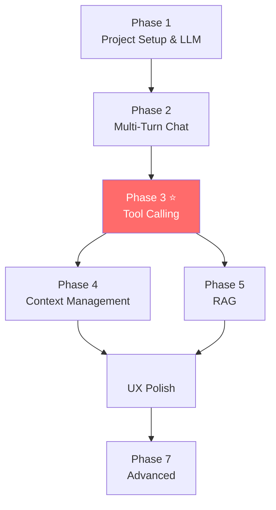

# 🚀 Roadmap: Membangun Amba-Gent AI Coding Assistant

> **Goal**: Membangun AI agent di terminal yang bisa membaca, memahami, dan mengedit codebase — seperti Claude Code / GitHub Copilot.

---

## Status Kamu Saat Ini

Kamu sudah punya fondasi awal di [main.py](file:///c:/laragon/www/amba-gent/main.py):
- ✅ Koneksi ke LLM via Anthropic SDK (proxy)
- ✅ Command [chat](file:///c:/laragon/www/amba-gent/main.py#17-41) — kirim pesan, terima jawaban
- ✅ Command [fix_code](file:///c:/laragon/www/amba-gent/main.py#42-72) — baca file, kirim ke LLM, tampilkan saran

**Yang belum ada**: Tool Calling, RAG, Context Window management, multi-turn conversation, dan kemampuan agent untuk benar-benar *bertindak* (baca/tulis file, cari kode, dll).

---

## Arsitektur Target

```
┌─────────────────────────────────────────────┐
│              USER (Terminal)                 │
│         ketik perintah / instruksi           │
└──────────────────┬──────────────────────────┘
                   │
┌──────────────────▼──────────────────────────┐
│           AMBA-GENT CORE (Python)            │
│                                              │
│  ┌──────────┐  ┌───────────┐  ┌──────────┐  │
│  │ Chat Loop│  │Tool Engine│  │ Context  │  │
│  │(multi-   │  │(dispatch &│  │ Manager  │  │
│  │ turn)    │  │ execute)  │  │(window)  │  │
│  └────┬─────┘  └─────┬─────┘  └────┬─────┘  │
│       │              │              │        │
│  ┌────▼──────────────▼──────────────▼─────┐  │
│  │           LLM Client (Anthropic SDK)   │  │
│  │     model: glm-5 via api.z.ai proxy    │  │
│  └────────────────────────────────────────┘  │
│                                              │
│  ┌────────────────────────────────────────┐  │
│  │              TOOLS                     │  │
│  │  read_file │ write_file │ list_dir     │  │
│  │  search_code │ run_command │ ask_user  │  │
│  └────────────────────────────────────────┘  │
│                                              │
│  ┌────────────────────────────────────────┐  │
│  │         RAG / Indexing (Opsional)      │  │
│  │  embed codebase → vector search        │  │
│  └────────────────────────────────────────┘  │
└──────────────────────────────────────────────┘
```

---

## Phase 1: Fondasi — Project Setup & LLM Connection

> **Tujuan**: Pastikan project terstruktur rapi dan koneksi LLM stabil.

### Step 1.1 — Struktur Project
Buat struktur folder yang scalable:

```
amba-gent/
├── main.py              # Entry point CLI
├── config.py            # API key, base URL, model (jangan hardcode!)
├── core/
│   ├── __init__.py
│   ├── llm_client.py    # Wrapper untuk panggil LLM
│   ├── chat_loop.py     # Multi-turn conversation handler
│   └── context.py       # Context window manager
├── tools/
│   ├── __init__.py
│   ├── file_tools.py    # read_file, write_file, list_dir
│   ├── search_tools.py  # grep/search di codebase
│   └── shell_tools.py   # run terminal commands
├── rag/
│   ├── __init__.py
│   ├── indexer.py       # Index codebase ke embeddings
│   └── retriever.py     # Search relevant code chunks
├── requirements.txt
└── .env                 # Simpan API key di sini
```

### Step 1.2 — Environment & Dependencies
- Install Python 3.10+
- Buat virtual environment (`python -m venv venv`)
- Install dependencies awal: `anthropic`, `typer`, `rich`, `python-dotenv`
- Pindahkan API key dari hardcode ke `.env` file

### Step 1.3 — LLM Client Wrapper
- Buat class `LLMClient` di `core/llm_client.py`
- Fungsinya: kirim messages → terima response
- Tambahkan error handling dan retry logic
- Tambahkan streaming support (print token-by-token, bukan tunggu semua selesai)

### 📚 Konsep yang Dipelajari
- Project structuring untuk CLI tools
- Environment variables & secrets management
- API client patterns (wrapper, retry, error handling)
- Streaming responses dari LLM

---

## Phase 2: Multi-Turn Conversation (Chat Loop)

> **Tujuan**: Amba-gent bisa "mengingat" percakapan, bukan hanya one-shot.

### Step 2.1 — Conversation History
- Simpan daftar messages `[{"role": "user", "content": "..."}, {"role": "assistant", "content": "..."}]`
- Setiap kali user kirim pesan baru, append ke history, lalu kirim seluruh history ke LLM

### Step 2.2 — Interactive Chat Loop (REPL)
- Buat mode interaktif: user masuk, ketik berulang kali, agent merespons
- Gunakan `input()` loop atau library seperti `prompt_toolkit` untuk UX yang lebih baik
- Tampilkan output dengan Rich Markdown

### Step 2.3 — System Prompt yang Kuat
- Tulis system prompt yang menjelaskan siapa amba-gent, apa kemampuannya
- System prompt harus menginstruksikan LLM untuk menggunakan tools (disiapkan di Phase 3)

### 📚 Konsep yang Dipelajari
- **Multi-turn conversation** — bagaimana LLM memproses history
- **REPL pattern** — Read-Eval-Print Loop untuk CLI interaktif
- **System prompt engineering** — mengarahkan perilaku LLM

---

## Phase 3: Tool Calling ⭐ (Inti dari Agent)

> **Tujuan**: LLM bisa *memutuskan sendiri* kapan harus baca file, tulis file, dll.

### Step 3.1 — Pahami Konsep Tool Calling
Tool calling (function calling) adalah mekanisme di mana:
1. Kamu definisikan daftar **tools** dengan nama, deskripsi, dan parameter (JSON Schema)
2. Kirim tools beserta messages ke LLM
3. LLM memutuskan untuk **memanggil tool** (bukan menjawab langsung)
4. Kamu **eksekusi tool** di sisi Python
5. Kirim **hasil tool** kembali ke LLM
6. LLM memberikan jawaban akhir berdasarkan hasil tool

```
User: "Tampilkan isi file main.py"
  → LLM decides: call read_file(path="main.py")
    → Python executes: open("main.py").read()
      → Result dikirim balik ke LLM
        → LLM: "Berikut isi file main.py: ..."
```

### Step 3.2 — Definisikan Tools
Mulai dengan tools dasar:

| Tool Name | Deskripsi | Parameters |
|-----------|-----------|------------|
| `read_file` | Baca isi file | `path: str` |
| `write_file` | Tulis/overwrite file | `path: str, content: str` |
| `list_directory` | List isi folder | `path: str` |
| `search_code` | Cari teks di codebase (grep) | `query: str, path: str` |
| `run_command` | Jalankan command di terminal | `command: str` |

Setiap tool didefinisikan sebagai dictionary JSON Schema yang dikirim ke API.

### Step 3.3 — Tool Execution Loop (Agent Loop)
Ini adalah **jantung dari agent**. Pseudocode-nya:

```
while True:
    response = llm.send(messages, tools)
    
    if response.stop_reason == "end_turn":
        print(response.text)
        break
    
    if response.stop_reason == "tool_use":
        for tool_call in response.tool_calls:
            result = execute_tool(tool_call.name, tool_call.params)
            messages.append(tool_call)
            messages.append(tool_result(result))
        
        continue  # kirim ulang ke LLM dengan hasil tool
```

Kunci penting:
- Loop ini bisa iterasi **berkali-kali** (LLM panggil banyak tools sebelum jawab)
- Kamu harus handle error dari tool execution
- Kirim balik error sebagai tool result agar LLM tahu dan bisa retry

### Step 3.4 — Implementasi Tools di Python
- Buat masing-masing fungsi di `tools/file_tools.py`, `tools/search_tools.py`, dll
- Buat **dispatcher**: mapping dari nama tool → fungsi Python
- Tambahkan safety checks (jangan hapus file di luar project, dll)

### Step 3.5 — Safety & Confirmation
- Tools yang **berbahaya** (write_file, run_command) → minta konfirmasi user dulu
- Tools yang **aman** (read_file, list_directory, search_code) → langsung eksekusi
- Tampilkan ke user tool apa yang dipanggil sebelum eksekusi

### 📚 Konsep yang Dipelajari
- **Tool/Function Calling** — cara LLM berinteraksi dengan dunia luar
- **Agent Loop** — pola dasar semua AI agent
- **JSON Schema** — format untuk definisi parameter tools
- **Safety patterns** — human-in-the-loop untuk aksi berbahaya

---

## Phase 4: Context Window Management

> **Tujuan**: Mengelola informasi yang dikirim ke LLM agar tidak melebihi batas token.

### Step 4.1 — Pahami Token Limits
- Setiap LLM punya batas context window (misal 128K tokens)
- Kalau pesan terlalu panjang → error atau dipotong
- Kamu harus kelola apa yang masuk dan keluar dari context

### Step 4.2 — Token Counting
- Gunakan tokenizer untuk hitung jumlah token dari messages
- Library: `tiktoken` (OpenAI) atau estimasi manual (~4 chars = 1 token)
- Sebelum kirim ke LLM, cek total token

### Step 4.3 — Strategi Context Management

| Strategi | Kapan Digunakan |
|----------|-----------------|
| **Truncation** | Potong history lama kalau terlalu panjang |
| **Summarization** | Minta LLM merangkum history lama |
| **Sliding Window** | Simpan N pesan terakhir saja |
| **Smart Selection** | Hanya masukkan file/code yang relevan |

### Step 4.4 — File Content Chunking
- File besar tidak boleh dimasukkan utuh ke context
- Bagi file jadi chunks (per fungsi, per class, atau per N baris)
- Hanya kirim chunk yang relevan

### 📚 Konsep yang Dipelajari
- **Token** — unit dasar yang diproses LLM
- **Context window** — batas memori LLM per request
- **Chunking** — strategi memecah dokumen besar

---

## Phase 5: RAG (Retrieval-Augmented Generation)

> **Tujuan**: Agent bisa mencari kode yang relevan dari seluruh codebase, bukan hanya file yang di-specify manual.

### Step 5.1 — Pahami Konsep RAG

```
User bertanya tentang "authentication"
  → Embed pertanyaan user menjadi vector
    → Cari vector yang mirip di index codebase
      → Dapat 5 file/chunk yang paling relevan
        → Kirim ke LLM sebagai context
          → LLM menjawab berdasarkan kode yang ditemukan
```

### Step 5.2 — Indexing Codebase
- Walk seluruh project directory
- Filter file yang relevan ([.py](file:///c:/laragon/www/amba-gent/main.py), `.js`, `.ts`, dll — skip `node_modules`, `.git`)
- Baca setiap file, pecah jadi chunks
- Generate embedding untuk setiap chunk (pakai embedding API atau local model)
- Simpan embeddings + metadata di vector store

### Step 5.3 — Pilih Vector Store
Opsi dari yang paling sederhana:

| Vector Store | Kompleksitas | Cocok Untuk |
|-------------|-------------|-------------|
| **In-memory list + cosine** | Sangat mudah | Belajar, project kecil |
| **ChromaDB** | Mudah | Project kecil-menengah |
| **FAISS** | Menengah | Project besar, cepat |
| **Qdrant** | Menengah-Sulit | Production |

> **Rekomendasi untuk belajar**: Mulai dari in-memory, lalu migrasi ke ChromaDB.

### Step 5.4 — Retrieval saat Agent Berjalan
- Sebelum/saat menjawab, cari chunk yang relevan dari index
- Masukkan chunk yang ditemukan ke context sebagai "codebase knowledge"
- Bisa juga dijadikan **tool**: `search_codebase(query)` → LLM panggil sendiri saat butuh

### Step 5.5 — Kapan Harus Re-Index
- Saat user pertama kali buka project
- Saat ada file yang berubah (file watcher opsional)
- Manual command: `amba-gent index`

### 📚 Konsep yang Dipelajari
- **Embeddings** — representasi teks sebagai angka/vector
- **Vector similarity search** — menemukan teks yang mirip
- **RAG pipeline** — retrieval → augment → generate
- **Indexing strategies** — chunking, filtering, metadata

---

## : UX & Polish

> **Tujuan**: Buat amba-gent nyaman digunakan sehari-hari.

### Step 6.1 — Streaming Output
- Tampilkan jawaban token-by-token (bukan tunggu selesai)
- Gunakan Anthropic streaming API + Rich live rendering

### Step 6.2 — Diff Preview
- Sebelum write_file, tampilkan **diff** perubahan
- Gunakan library `difflib` bawaan Python
- User konfirmasi: Apply / Reject / Edit

### Step 6.3 — Session Management
- Simpan history percakapan ke file (JSON/SQLite)
- Bisa resume session sebelumnya
- Command: `amba-gent resume`

### Step 6.4 — Project Auto-Detection
- Auto-detect project type dari file yang ada (package.json → Node, requirements.txt → Python)
- Sesuaikan system prompt berdasarkan project type
- Auto-set working directory

### Step 6.5 — Progress & Status
- Tampilkan spinner saat LLM berpikir
- Log tool calls yang dieksekusi (tool apa, parameter apa, hasilnya apa)
- Colored output untuk membedakan user, agent, tool, error

### 📚 Konsep yang Dipelajari
- **Streaming** — mengalirkan data secara real-time
- **Diff rendering** — visualisasi perubahan kode
- **State persistence** — menyimpan dan mengembalikan state aplikasi

---

## Phase 7: Advanced Features (Opsional)

> **Tujuan**: Fitur lanjutan untuk mendekati kemampuan Claude Code / Copilot.

### Step 7.1 — Parallel Tool Calls
- LLM bisa panggil beberapa tools sekaligus
- Eksekusi secara concurrent dengan `asyncio`

### Step 7.2 — Multi-File Editing
- Agent bisa edit beberapa file sekaligus dalam satu instruksi
- Contoh: "Tambahkan endpoint baru di routes.py dan modelnya di models.py"

### Step 7.3 — Sub-Agent / Planning
- Agent memecah tugas besar jadi steps kecil
- Eksekusi step-by-step dengan checkpoint
- Bisa rollback kalau gagal

### Step 7.4 — Git Integration
- Auto-commit setelah perubahan
- Buat branch sebelum perubahan besar
- Tool: `git_status`, `git_diff`, `git_commit`

### Step 7.5 — MCP (Model Context Protocol) Server
- Jadikan amba-gent sebagai MCP server
- Bisa diakses dari VS Code, editor lain, atau tools lain

---

## Urutan Eksekusi yang Disarankan



> **Phase 3 (Tool Calling) adalah yang paling krusial.** Ini yang membedakan chatbot biasa dengan AI agent.

---

## Checklist Progress

| Phase | Status | Deliverable |
|-------|--------|-------------|
| Phase 1 — Fondasi | 🟡 Partial | Project terstruktur, LLM connected |
| Phase 2 — Chat Loop | ⬜ Belum | Multi-turn REPL berjalan |
| Phase 3 — Tool Calling | ⬜ Belum | Agent bisa read/write file sendiri |
| Phase 4 — Context | ⬜ Belum | Tidak crash karena token limit |
| Phase 5 — RAG | ⬜ Belum | Cari kode relevan otomatis |
|  — UX | ⬜ Belum | Diff preview, streaming |
| Phase 7 — Advanced | ⬜ Belum | Multi-file, git, planning |

---

> 💡 **Tips**: Jangan lompat ke Phase 5 (RAG) sebelum Phase 3 (Tool Calling) benar-benar solid. Tool Calling adalah fondasi utama agent. RAG itu "nice-to-have" yang memperkaya context — tapi tanpa Tool Calling, agent-mu hanya chatbot biasa.
